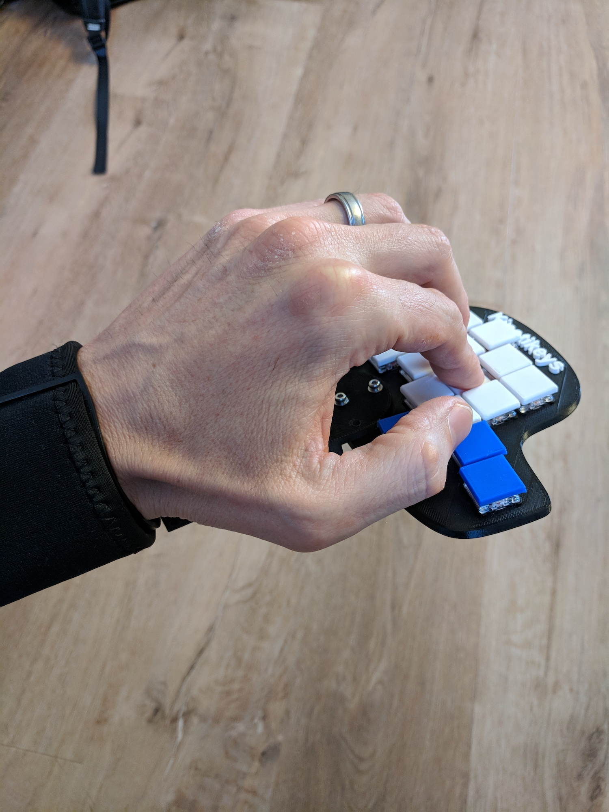
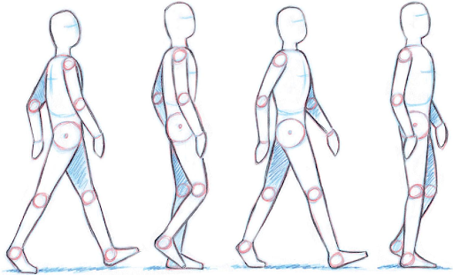
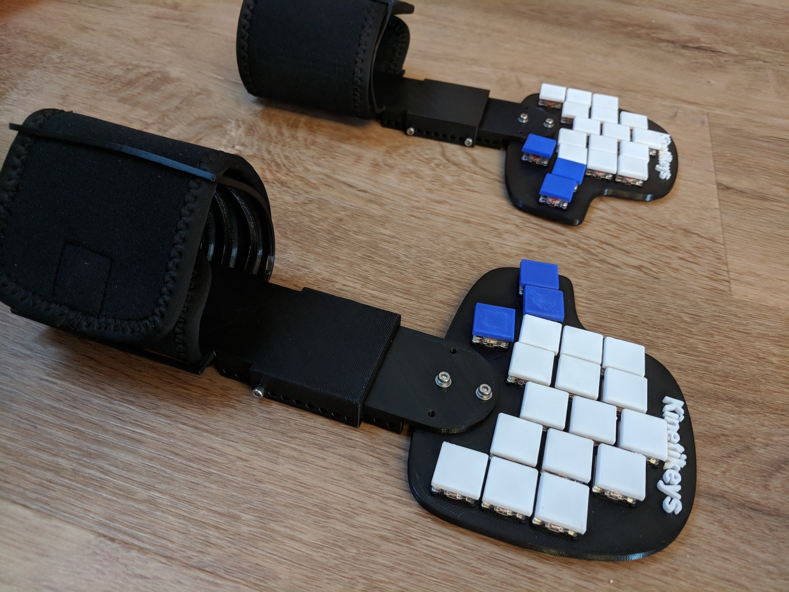
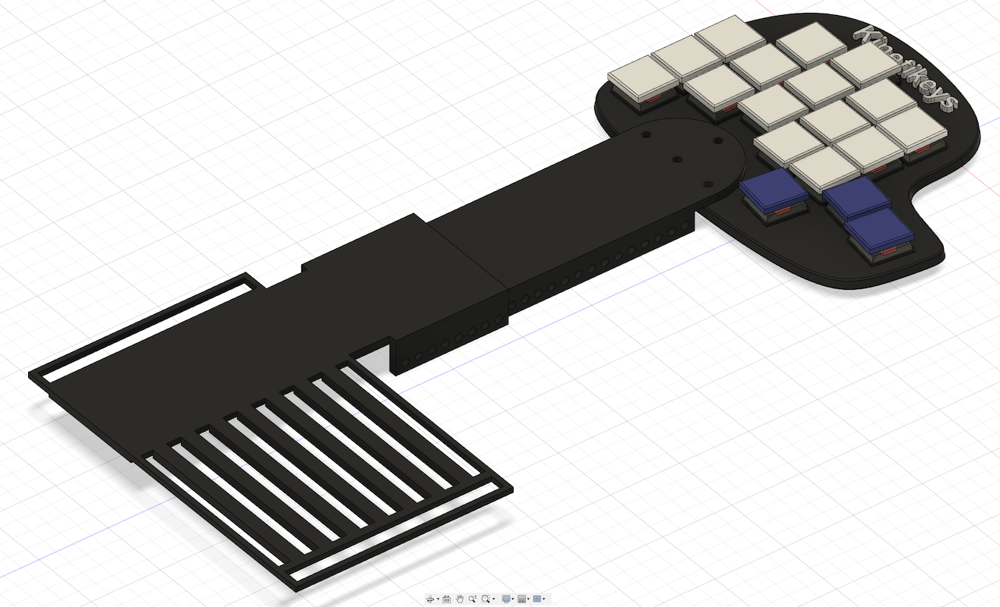
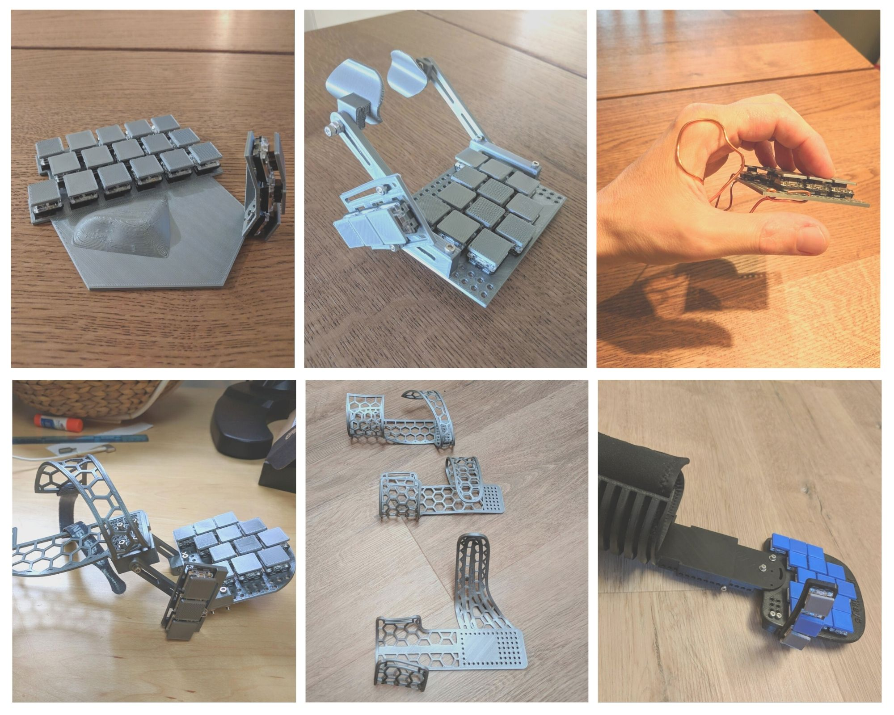

# Kinetikeys - Concept0 - Type while walking

Note: Please check out the newer prototype I'm working on:
[Kinetikeys-Chorder](https://github.com/liorgonnen/kinetikeys-chorder)

### Preface

Our body is designed to be in motion. It’s not meant to be still, but most of us who work on a computer, spend most of our day sitting down, or even standing up, but we don’t move as much as our body needs.

Sitting is considered the new smoking. People are trying to mitigate this problem in many ways: standing desks, standing chairs, fitballs, balance boards, split ergonomic keyboards, and more. The problem remains, however, that ergonomically, our work environment has changed just incrementally in decades, but the the amount of hours sitting has increased significantly.

### Introduction

Kinetikeys is a working connceptual prototype of a split, ergonomic, wearable, bluetooth keyboard. 
Its goal is to validate the following hypothesis:

***It’s possible to type in full-speed[1] while walking naturally[2] at a convenient pace[3] with a minimal[4] learning curve***

Where:

1. **Full-speed** means your personal full speed.
2. **Walking nanturally** means walking on a treadmill while maintaining natural arm movement
3. **Convenient Pace** is the pace you'd walk around the office (When not in a hurry :) )
4. Comparable to switching from a regular querty keyboard to any other split ergonomic keyboard

### Design Assumptions
* **Familiar** - Although the form-factor is a bit different than a regular keyboard, it needs to feel familiar and easy to get up to speed with to allow adoption with minimal productivity loss
* **Tactile** - A tactile keyboard is a must-have for engineers. This must not be touch/gesture based. Again, it needs to feel familiar
* **Qwerty** - The purpose of this iteration is not to reinvent the wheel or to rethink the concept of a keyboard. The goal is to introduce a new use-case to a keyboard form-factor people are familiar with and test the hypothesis of typing while walking.

# Technical Notes

- **Design** - Using Autodesk [Fusion 360](https://www.autodesk.com/products/fusion-360/overview)
- **PCB Design** - Using [EasyEDA](https://easyeda.com/)
- **Parts** - 3D printed using [Original Prusa i3 MK3](https://shop.prusa3d.com/en/3d-printers/59-original-prusa-i3-mk2-kit.html?gclid=CjwKCAjwxILdBRBqEiwAHL2R82n_dv26QGDwVplmQ5JjPbts2AS6vM7VwUfdA9-k5OvphJqExG3HoBoCetMQAvD_BwE)
- **Keys** - [Kail Choc Low-Profile (Red)](https://novelkeys.xyz/collections/switches/products/kailh-low-profile-switches?variant=3747939680296) mechanical keys
- **Wrist attachments** - A modified version of [HiRui wrist braces](http://a.co/d/fCxWbRO)
- **Microcontroller** - [Adafruit Feather nRF52 Bluefruit](https://learn.adafruit.com/bluefruit-nrf52-feather-learning-guide?view=all)
- **Software** - Arduino code

# Early Iterations

# Next Concept
See the newer concept here: [Kinetikeys-Chorder](https://github.com/liorgonnen/kinetikeys-chorder)

